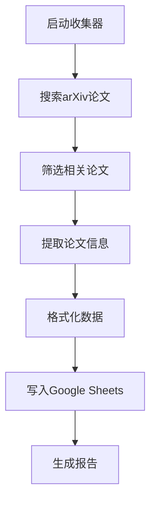

# 推荐系统论文收集器 (Recommendation Paper Collector)

一个自动化的工具，用于搜索、收集和整理推荐系统相关论文，特别是预训练方向的研究，并将结果自动写入Google Sheets。

## 功能特性

- 🔍 **智能搜索**: 自动搜索arXiv上最新的推荐系统论文
- 🎯 **精准筛选**: 基于关键词和分类筛选相关论文
- 📝 **信息提取**: 提取论文标题、作者、摘要、亮点等关键信息
- 📊 **自动整理**: 将数据整理为标准化表格格式
- 🚀 **一键写入**: 自动将结果写入指定的Google Sheets文档
- ⚙️ **高度可配置**: 支持自定义搜索参数和输出格式

## 安装依赖

```bash
# 安装Python依赖
pip install arxiv google-auth google-auth-oauthlib google-auth-httplib2 google-api-python-client
```

## 快速开始

### 命令行使用

```bash
# 基本使用（使用默认配置）
python main.py

# 搜索最近3天的论文
python main.py --days 3

# 搜索最多30篇论文
python main.py --max 30

# 指定Google Sheets链接
python main.py --url "https://docs.google.com/spreadsheets/d/YOUR_SHEET_ID"

# 清空现有内容后写入
python main.py --clear
```

### Python API使用

```python
from main import RecommendationPaperCollector

# 创建收集器
collector = RecommendationPaperCollector()

# 运行完整流程
result = collector.run(
    days_back=7,
    max_papers=20,
    sheet_url="https://docs.google.com/spreadsheets/d/YOUR_SHEET_ID",
    sheet_name="推荐系统热点论文",
    clear_first=True
)

if result["success"]:
    print(f"成功处理 {result['stats']['written']} 篇论文")
    print(f"表格链接: {result['sheet_url']}")
```

## 配置说明

### 配置文件 (defaults.json)

```json
{
  "search_categories": ["cs.IR", "cs.LG", "cs.AI"],
  "days_back": 7,
  "max_papers": 20,
  "keywords": [
    "recommendation",
    "recommender",
    "pretrain",
    "pretraining",
    "multimodal",
    "federated",
    "sequential",
    "retrieval",
    "collaborative filtering",
    "personalization"
  ],
  "fields": [
    "序号",
    "论文标题",
    "作者",
    "发表时间",
    "arXiv ID",
    "内容概括",
    "亮点做法",
    "代表性图片说明",
    "论文链接",
    "分类"
  ],
  "default_sheet_url": "https://docs.google.com/spreadsheets/d/YOUR_SHEET_ID",
  "sheet_name": "推荐系统热点论文",
  "google_credentials": {
    "token_path": "/path/to/token.json",
    "client_secret_path": "/path/to/client_secret.json"
  }
}
```

### Google API配置

1. 在[Google Cloud Console](https://console.cloud.google.com/)创建项目
2. 启用Google Sheets API
3. 创建OAuth 2.0凭据
4. 下载`client_secret.json`文件
5. 首次运行会引导完成授权流程

## 工作流程



## 输出格式

### Google Sheets表格结构

| 序号 | 论文标题 | 作者 | 发表时间 | arXiv ID | 内容概括 | 亮点做法 | 代表性图片说明 | 论文链接 | 分类 |
| ---- | -------- | ---- | -------- | -------- | -------- | -------- | -------------- | -------- | ---- |

### 输出示例

```
序号: 1
论文标题: VLM2Rec: Resolving Modality Collapse in Vision-Language Model Embedders for Multimodal Sequential Recommendation
作者: Junyoung Kim, Woojoo Kim, Jaehyung Lim, Dongha Kim, Hwanjo Yu
发表时间: 2026-03-18
arXiv ID: 2603.17450v1
内容概括: 该论文研究了多模态顺序推荐中的模态崩溃问题...
亮点做法: 1. 将Vision-Language Models作为CF-aware多模态编码器...
代表性图片说明: VLM2Rec框架架构图，展示多模态编码器...
论文链接: https://arxiv.org/abs/2603.17450v1
分类: cs.IR, cs.AI
```

## 错误处理

### 常见问题及解决方案

1. **arXiv API连接失败**
   - 检查网络连接
   - 尝试使用备用搜索方法

2. **Google Sheets权限错误**
   - 检查OAuth凭据是否有效
   - 确认有足够的API配额

3. **无相关论文找到**
   - 扩大搜索范围（增加天数、调整关键词）
   - 检查arXiv分类是否正确

### 日志记录

程序会输出详细的运行日志：

```
🔄 开始收集推荐系统论文...
📊 搜索参数: 时间范围: 最近7天, 最大数量: 20篇
✅ 搜索完成: 总共找到: 25篇论文, 相关论文: 12篇
🔄 开始处理论文信息...
✅ 处理完成: 12篇论文已格式化
🔄 开始写入Google Sheets...
✅ 写入成功! 更新单元格: 120, 写入论文: 12篇
```

## 计划功能

- [ ] 支持其他论文数据库（如ACL、KDD等）
- [ ] 增加论文相似度去重
- [ ] 支持导出为多种格式（CSV、Excel、Markdown）
- [ ] 添加定时任务功能
- [ ] 集成文献管理软件（如Zotero）

## 贡献指南

1. Fork本仓库
2. 创建功能分支 (`git checkout -b feature/AmazingFeature`)
3. 提交更改 (`git commit -m 'Add some AmazingFeature'`)
4. 推送到分支 (`git push origin feature/AmazingFeature`)
5. 开启Pull Request

## 许可证

本项目采用MIT许可证。详见[LICENSE](LICENSE)文件。

## 联系方式

- 问题反馈: [GitHub Issues](https://github.com/yourusername/recommendation-paper-collector/issues)
- 功能建议: 欢迎提交Pull Request

---

**版本**: 1.0.0  
**最后更新**: 2026-03-19  
**维护者**: 渣渣 🤖  
**状态**: 🟢 生产就绪
