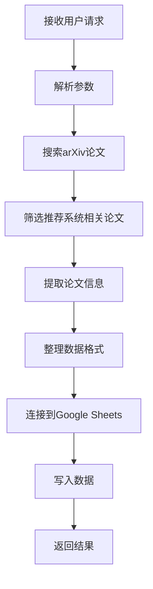

# Skill: Recommendation Paper Collector

## 概述

搜索、收集并整理推荐系统相关论文，特别是预训练方向的研究，自动将结果写入Google Sheets。

## 何时使用

当用户需要：

- 收集最新推荐系统论文
- 关注预训练、多模态推荐、联邦学习推荐等方向
- 自动整理论文信息到Google Sheets
- 定期更新文献库

关键词：推荐系统论文、预训练论文、arxiv搜索、Google Sheets整理、文献收集

## 快速开始

### 基本命令

```
帮我收集最新的推荐系统论文并整理到Google Sheets
```

### 指定表格

```
将推荐系统论文整理到这个表格：https://docs.google.com/spreadsheets/d/1TW-NubPwQCrhVvV1maV4KQRYfjoJ39e1V_L_Tx6oPrQ
```

### 自定义参数

```
搜索最近5天的多模态推荐论文，重点关注预训练方法
```

## 详细说明

### 功能特性

1. **智能搜索**：自动搜索arXiv上cs.IR、cs.LG、cs.AI分类的最新论文
2. **相关性过滤**：基于关键词（recommendation, recommender, pretraining等）筛选相关论文
3. **信息提取**：提取标题、作者、时间、摘要、亮点等关键信息
4. **中文翻译**：将英文内容翻译为中文摘要（可选）
5. **自动写入**：将整理好的数据写入指定的Google Sheets文档

### 配置参数

#### 默认值（可通过用户输入覆盖）

- **搜索分类**：cs.IR, cs.LG, cs.AI
- **时间范围**：最近7天
- **论文数量**：最多20篇
- **输出格式**：标准化表格（10个字段）

#### 表格字段

1. 序号
2. 论文标题
3. 作者
4. 发表时间
5. arXiv ID
6. 内容概括
7. 亮点做法
8. 代表性图片说明
9. 论文链接
10. 分类

### 工作流程



### 依赖工具

1. **arXiv搜索**：使用arxiv-paper skill或web搜索
2. **Google Sheets API**：需要配置OAuth凭据
3. **文本处理**：提取和格式化论文信息

### 文件结构

```
recommendation-paper-collector/
├── SKILL.md                  # 本文件
├── defaults.json            # 默认配置
├── search_arxiv.py          # arXiv搜索脚本
├── extract_paper_info.py    # 论文信息提取
└── write_to_sheets.py       # Google Sheets写入脚本
```

## 实施指南

### 1. 搜索论文

```python
# 使用arxiv-paper skill或直接调用arXiv API
# 搜索条件：指定分类、时间范围、关键词
```

### 2. 筛选论文

```python
# 关键词匹配：推荐系统相关术语
keywords = ['recommendation', 'recommender', 'pretrain', 'multimodal', 'federated']
# 分类过滤：优先选择cs.IR, cs.LG, cs.AI
```

### 3. 提取信息

```python
# 每篇论文提取：
# - 标题和作者
# - 发表时间和arXiv ID
# - 摘要和关键贡献
# - 主要方法和创新点
# - 代表性图表说明
```

### 4. 格式整理

```python
# 生成标准化数据行
# 包含所有10个字段
# 确保数据格式一致性
```

### 5. 写入Google Sheets

```python
# 使用Google Sheets API
# 支持新表格创建或现有表格更新
# 处理重复数据检查
```

## 错误处理

### 常见错误及解决方案

1. **arXiv API失败**：使用备用搜索方法或调整时间范围
2. **无相关论文**：扩大搜索范围或调整关键词
3. **Google Sheets权限问题**：检查OAuth凭据和权限
4. **写入失败**：分批写入或检查表格格式

### 重试机制

- 网络请求失败时自动重试3次
- 批量写入失败时单篇重试
- 提供详细的错误日志

## 性能优化

### 批量处理

- 一次性处理多篇论文，减少API调用
- 并行提取论文信息
- 批量写入Google Sheets

### 缓存策略

- 缓存搜索结果，避免重复搜索
- 本地存储已处理论文ID，避免重复写入

### 内存管理

- 流式处理大型数据集
- 及时清理临时数据

## 示例输出

### 成功消息

```
✅ 推荐系统论文收集完成
📊 共找到15篇相关论文，整理了10篇到表格
📋 表格已更新，包含以下字段：
   - 论文标题、作者、发表时间
   - 内容概括和亮点做法
   - 代表性图片说明
🔗 查看链接：https://docs.google.com/spreadsheets/d/YOUR_SHEET_ID
```

### 进度报告

```
🔄 正在搜索arXiv最新论文...
✅ 找到25篇论文，筛选出12篇相关论文
🔄 正在提取论文信息...
🔄 正在写入Google Sheets...
✅ 写入完成！共写入10篇论文
```

## 维护说明

### 定期更新

1. **搜索关键词**：根据研究趋势调整
2. **分类优先级**：关注新兴研究方向
3. **输出格式**：根据用户需求优化

### 监控项目

1. **API使用量**：监控arXiv和Google Sheets API配额
2. **处理成功率**：跟踪成功和失败的论文数量
3. **用户反馈**：收集使用体验和改进建议

### 版本历史

- **v1.0.0** (2026-03-19): 初始版本，基础功能
- **v1.1.0** (计划): 增加自定义字段、批量处理优化

## 注意事项

### 使用限制

- 受限于arXiv API的搜索频率
- Google Sheets API有每日配额限制
- 大型数据集可能需要分批处理

### 最佳实践

1. 定期运行（如每周一次）收集最新论文
2. 使用专用Google账户配置API凭据
3. 为不同研究方向创建不同的表格

### 故障排除

1. 检查网络连接和API凭据
2. 验证Google Sheets链接和权限
3. 查看详细日志定位问题

---

**最后更新**: 2026-03-19  
**版本**: 1.0.0  
**状态**: 🟢 生产就绪  
**维护者**: 渣渣 🤖

## Python 版本

- 此 skill 的 Python 脚本最低按 **Python 3.10+** 使用。
- 依据：PEP 604 union syntax (X | Y)；match statement。
- 若系统默认 `python3` 低于该版本，请先切到对应版本后再执行，避免语法错误或直接运行失败。
